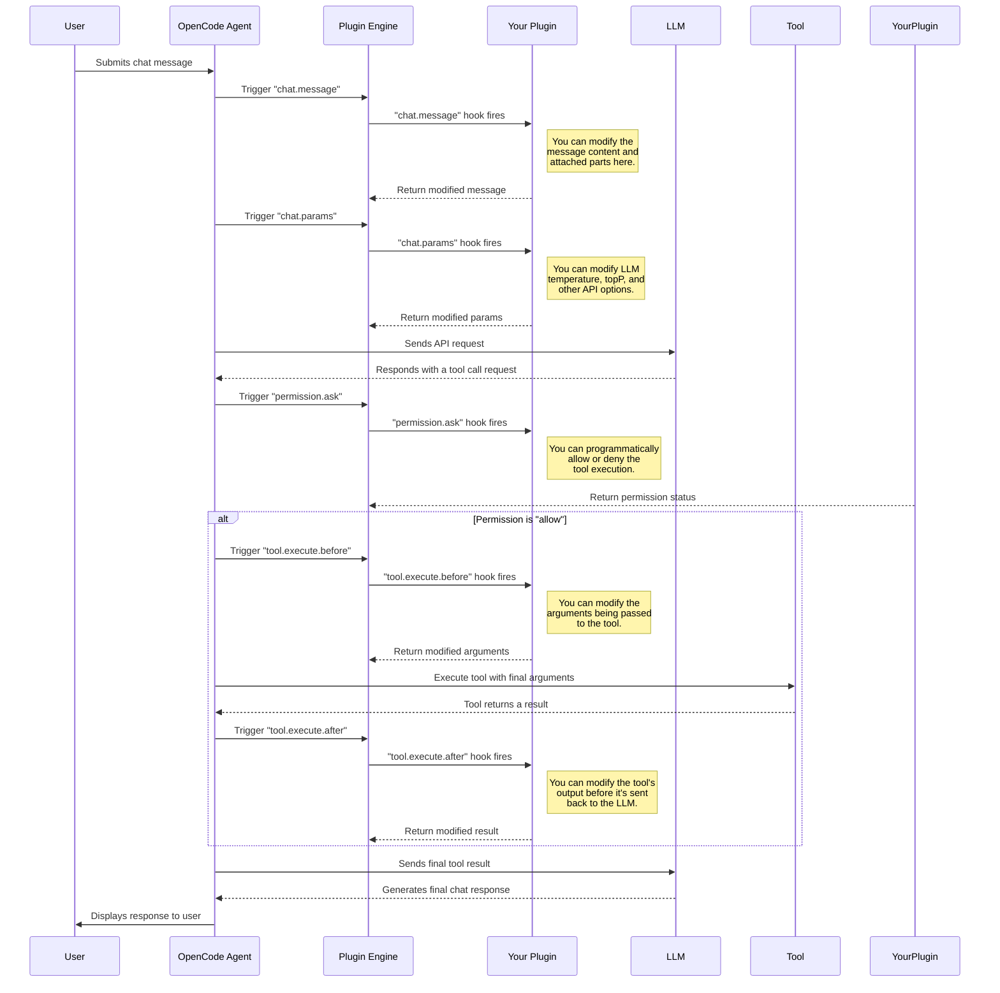

[⬅️ Previous: Getting Started](./02-getting-started.md) | [🔝 Summary](./README.md) | [➡️ Next: Practical Examples](./04-practical-examples.md)

# 3. Plugin Lifecycle & Hooks

Understanding the plugin lifecycle is key to building effective plugins.  
This section details every available hook, its purpose, and provides a visual diagram of when each hook is triggered.

---

## The `Hooks` Object

Your plugin's initializer function must return a `Hooks` object.  
The keys of this object are the names of the events you want to subscribe to, and the values are async functions that handle those events.

```typescript
import type { Plugin, Hooks, PluginInput } from '@opencode-ai/plugin';

const myPlugin: Plugin = async (input: PluginInput): Promise<Hooks> => {
  return {
    // This is a hook subscription.
    // The key is the hook name, the value is the handler function.
    async "chat.message"(input, output) {
      // Your logic here...
    }
  };
};

export default myPlugin;
```

---

## Complete Hook Reference

Below is a list of all hooks available in the OpenCode plugin system:

### `chat.message`
Intercept and modify a user's message *before* it is processed by the agent.

- **Signature:** `(input: {}, output: { message: UserMessage; parts: Part[] }) => Promise<void>`
- **Use Case:** Censor words, attach files, or inject context into the user's prompt.
- **Note:** `output` can be modified.

---

### `chat.params`
Modify the parameters sent to the Language Model for a chat completion request.

- **Signature:** `(input: { model: Model; provider: Provider; message: UserMessage }, output: { temperature: number; topP: number; options: Record<string, any> }) => Promise<void>`
- **Use Case:** Adjust LLM parameters or add provider-specific options.
- **Note:** `output` can be modified.

---

### `permission.ask`
Programmatically approve or deny a permission request, bypassing the user prompt.

- **Signature:** `(input: Permission, output: { status: "ask" | "deny" | "allow" }) => Promise<void>`
- **Use Case:** Auto-approve trusted commands or deny-list specific actions.
- **Note:** `output` can be modified.

---

### `tool.execute.before`
Intercept and modify the arguments for a tool call *before* it is executed.

- **Signature:** `(input: { tool: string; sessionID: string; callID:string }, output: { args: any }) => Promise<void>`
- **Use Case:** Sanitize file paths, inject defaults, or log usage.
- **Note:** `output` can be modified.

---

### `tool.execute.after`
Intercept and modify the result of a tool call *after* it has executed but *before* it is sent back to the LLM.

- **Signature:** `(input: { tool: string; sessionID: string; callID: string }, output: { title: string; output: string; metadata: any }) => Promise<void>`
- **Use Case:** Redact sensitive info, format output, or add metadata.
- **Note:** `output` can be modified.

---

### `event`
A generic, catch-all listener for every event on the OpenCode event bus.

- **Signature:** `(input: { event: Event }) => Promise<void>`
- **Use Case:** Logging, debugging, or external monitoring.
- **Note:** `output` cannot be modified.

---

### `auth`
Implement custom authentication strategies for providers.

- **Use Case:** Add new OAuth or API key authentication flows.
- **Note:** This is an advanced feature. See [Advanced Topics](./05-advanced-topics.md) for more.

---

## Plugin Execution Lifecycle Diagram

This diagram shows the sequence of a typical user request and highlights when each plugin hook is executed.



---

Continue to [4. Practical Examples](./04-practical-examples.md) for real-world plugin code.

---
[⬅️ Previous: Getting Started](./02-getting-started.md) | [🔝 Summary](./README.md) | [➡️ Next: Practical Examples](./04-practical-examples.md)
