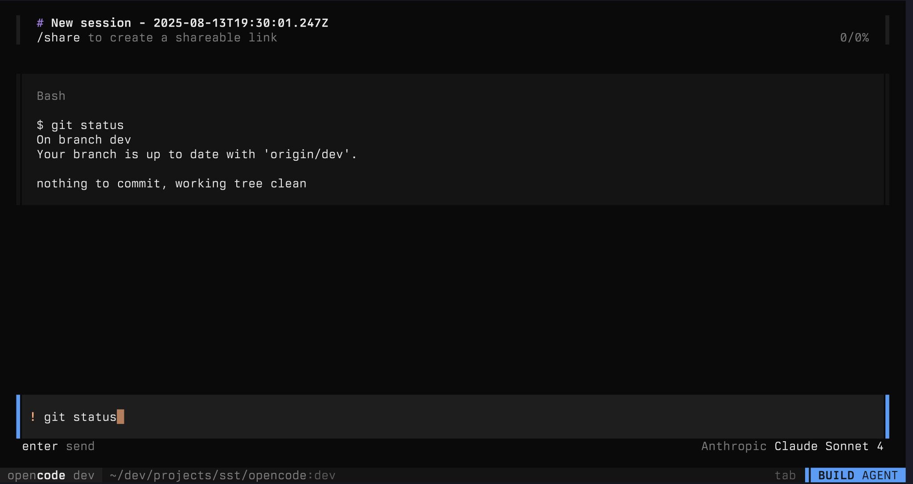

# Opencode Usage Tips

A curated collection of practical tips and tricks for getting the most out of Opencode. Simple, focused, and always a bit fancy.

---

## 📋 Quick Summary

- [**Run Shell Commands in Session** (`!`)](#1-run-shell-commands-in-your-session-) — Instantly execute shell commands and share results with the agent.
- [**Navigate Subagent Sessions** (`ctrl+right` / `ctrl+left`)](#2-navigate-subagent-sessions-ctrlright--ctrlleft) — Effortlessly move between parent and child agent sessions for better workflow visibility.

---

## 💡 Tips & Details

### 1. Run Shell Commands in Your Session (`!`)

> **Available since:** Opencode v0.4.43  
> **How:** Prefix any input with `!` to run a shell command directly in your session.

- **Why:** The output is visible to both you and the agent, making it easy to provide extra context or debug issues together.
- **Example:**  
  ```shell
  ! git status
  ```
  This will run `git status` in your current project directory and display the result in the chat window (see screenshot below).

- **Use case:**  
  - Quickly check the state of your repo, list files, or run tests.
  - Share command outputs with the agent for troubleshooting or context.



---

### 2. Navigate Subagent Sessions (`ctrl+right` / `ctrl+left`)

> **Available since:** Opencode v0.5.2  
> **How:**  
> - `ctrl+right` — Enter a child (subagent) session  
> - `ctrl+left` — Return to the parent session

- **Why:** Opencode supports hierarchical agent sessions. This feature lets you dive into subagent conversations (for example, when an agent spawns a helper agent) and then return to your main session, keeping complex workflows organized and easy to follow.
- **Reference:** [Demo by @adamdotdev on X](https://x.com/adamdotdev/status/1956415444706799786)

---

## ✨ More Tips?

Have a favorite workflow or configuration trick?  
Contribute your tips to this file!
