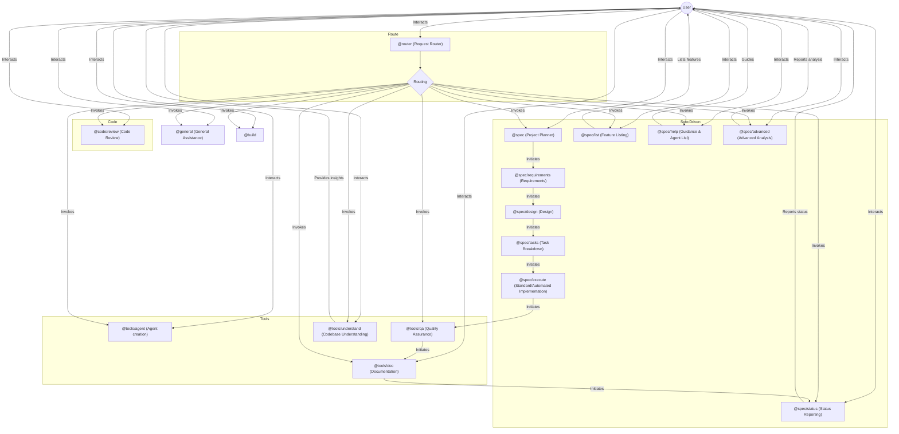

# 🔄 Opencode Agent Workflow

This document illustrates how Opencode agents and subagents communicate and work together throughout the development lifecycle.

---

## 🗺️ Workflow Overview

### 🆕 Command Integration
- Use `/create-pr` to open a pull request directly from your branch, leveraging GitHub MCP.
- Use `/review` to analyze and improve code before or after PR creation.
- These commands standardize and automate PR/review steps in the workflow.

## 📝 Diagram Explanation

- **User Interactions:** Users can start with any agent, but typically use `@router` to route their request, `@general` for open-ended help, or `@build` for disciplined TDD.
- **Request Routing:** The `@router` agent analyzes each request and dispatches it to the most suitable specialized agent, ensuring efficient handling and expert support.
- **Spec-Driven Pipeline:**
  1. **@spec**: Project planning and feature breakdown.
  2. **@spec/list**: Listing all features.
  3. **@spec/requirements**: Detailing requirements in EARS format.
  4. **@spec/design**: Creating technical design.
  5. **@spec/tasks**: Breaking design into TDD tasks.
  6. **@spec/execute**: Implementing features.
  7. **@tools/qa**: Running quality checks.
  8. **@tools/doc**: Updating documentation.
  9. **@spec/status**: Reporting status.
- **Parallel and On-Demand Tools:** Documentation and codebase understanding tools can be invoked at any time, supporting parallelism and deeper analysis.
- **Status and Guidance:** Agents like `@spec/status`, `@spec/help`, and `@spec/advanced` provide ongoing feedback, guidance, and advanced analysis.
- **Explicit Approval Gates:** Each phase requires user approval before proceeding, ensuring quality and user control.

This workflow ensures that every request is handled by the most capable agent, with clear transitions, quality checks, and opportunities for user feedback at every stage.

---

## 🔗 See Also

- [Routing Rules & Best Practices](./routing-rules.md)
- [Spec-Driven Agentic Development](./spec-drive-agentic-dev.md)
- [Glossary](./glossary.md)

